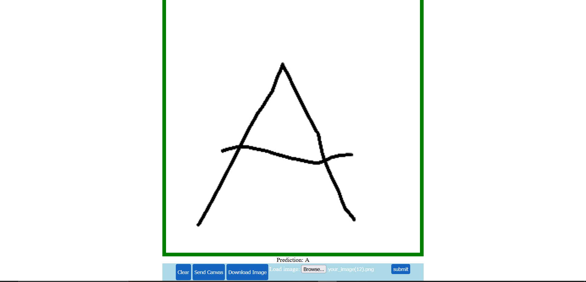

# handwriting-improver

## Description

Write a upper case letter in the English alphabet and see if an AI can understand it. Can be used to improve your handwriting or for playing around to see how an image recognition machine learning algorithm might work. You can save the letter you created, upload an image for the model to guess, or use the canvas to make an image and send it to the model. Uses FastAPI and uvicorn for the server side and PyTorch to make the CNN.

## Table of Contents

- [Data](#data)
- [To-do](#to-do)
- [Running Locally](#running-locally)
- [Deployment](#deployment)
- [Layout](#layout)
- [Credits](#credits)

# Data

The data used is handwritten English upper-case letters. The dataset has been compiled by Sachin Patel and can be downloaded [here](https://www.kaggle.com/datasets/sachinpatel21/az-handwritten-alphabets-in-csv-format).

# To-do

- [ ] Make background image work when running with uvicorn
- [ ] Improve the look of the website
- [ ] Maybe train a new, better model
- [ ] Consider removing the edges of submitted images (box around the given letter) so that we can resize/center image better

## Running Locally

Below are the steps needed to take for you to run the project locally, when using Docker:

0. Make sure you have Docker installed
1. Make sure you have the stable internet connection to download the required libraries etc.
2. (This may or may not be necessary depending on your operating system etc.) Start Docker Desktop or something similar
3. Go to the same folder where this README.md is on the root folder
4. Type "docker build -t handwriting-improver . && docker run --rm -it -p 8000:8000 handwriting-improver"
5. Use curl commands or your browser (at [http://127.0.0.1:8000/](http://127.0.0.1:8000/)) to use the application.

You can also create a virtual environment (with Python 3.11.6) and use the requirements.txt to download the required libraries. Then go to the app folder and just run "uvicorn server:app --reload".

If you do not want to use the CPU versions of torch, torchaudio, and torchvision, then you can remove the "+cpu" part from their corresponding rows in requirements.txt. If you want to do that and use Docker, you may remove the "-f" flags and the links related to them since these were added because the official Python Docker Images do not have the CPU versions of the three libraries, mentioned above, natively.

# Deployment

Deployment: [here](https://handwriting-improver.onrender.com/)

## Layout

The general look:

## Credits

Background image by Pete Linforth from [pixabay.com](https://pixabay.com/photos/connection-hand-human-robot-touch-3308188/) under the Creative Commons Zero (CC0) license.

Dataset by Sachin Patel from [kaggle.com](https://www.kaggle.com/datasets/sachinpatel21/az-handwritten-alphabets-in-csv-format) under the Creative Commons Zero (CC0: Public Domain) license.
